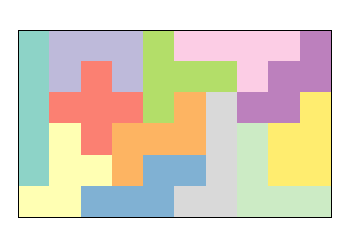

# pentomino

The script `pentomino.R`, written in the programming language "R", can be used 
to find the solutions of the Pentomino puzzle.

# Pentomino: My Favourite Puzzle

The Pentomino puzzle consists of twelve unique parts, each of which is 
composed of five unit squares. I gave each part the name of a letter:

```
I: █  L: █    Y: █    V: █     T: █ █ █  X:  █      
   █     █       █ █     █          █      █ █ █
   █     █       █       █ █ █      █        █
   █     █ █     █
   █

M: █ █    E: █ █     U: █   █  K:  █ █  P: █ █  S:  █ █ 
     █ █       █ █ █    █ █ █    █ █       █ █      █
       █                           █       █      █ █
```

The task is to puzzle the parts together into a rectangular field with a size
of 12 * 5 = 60 unit squares, i.e. sized 3 x 15, 5 x 12, 6 x 10.

The script `pentomino.R` finds all solutions for the 6 x 10 rectangle. 

This is one possible solution:

```
T T T X M M Y Y Y Y
I T X X X M M Y K K
I T S X E E M K K V
I P S S S E E E K V
I P P U S U L V V V
I P P U U U L L L L
```


